# UK Agriculture Industry Structure

A demonstration of how to import complex spreadsheets with
[tidyxl](https://nacnudus.github.io/tidyxl) and
[unpivotr](https://nacnudus.github.io/unpivotr).

The example spreadsheets are from the United Kingdom Department for Environment,
Food & Rural Affairs collection [Structure of the agricultural industry in
England and the UK at
June](https://www.gov.uk/government/statistical-data-sets/structure-of-the-agricultural-industry-in-england-and-the-uk-at-june),
which are "detailed annual statistics on the structure of the agricultural
industry at 1 June in England and the UK".

Each spreadsheet file is in its own folder, along with an R script to import it
in a tidy fashion.  Most of the files were originally `.xls` or `.ods` so were
converted to `.xlsx` (for compatibility with tidyxl) using LibreOffice's
command-line utility.

```sh
libreoffice --convert-to xlsx */*
```

# Spreadsheet screenshots

## defra-stats-foodfarm-landuselivestock-june-results-aonb-series-09nov17

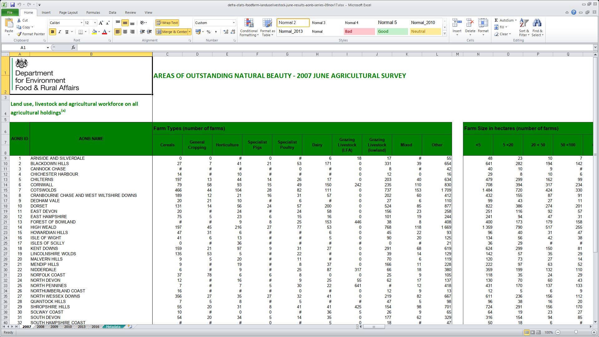

## defra-stats-foodfarm-landuselivestock-june-results-england-1900series111129

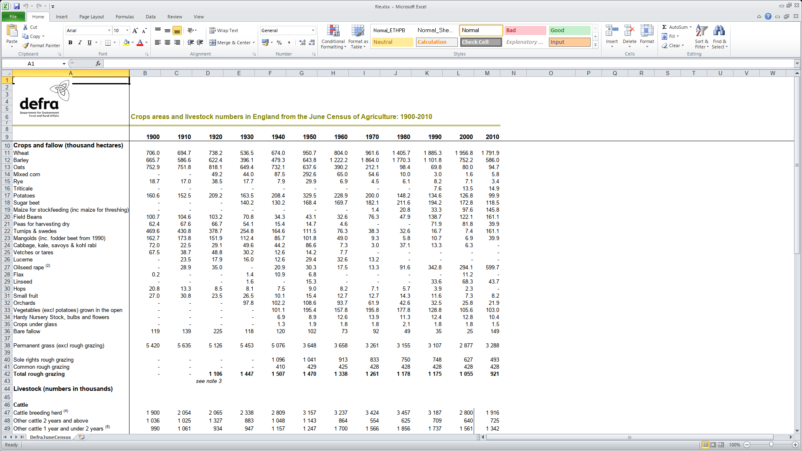

## defra-stats-foodfarm-landuselivestock-june-results-nationalcharacterareas-20mar18


## defra-stats-foodfarm-landuselivestock-june-results-nationalparks-16jan18


## structure_june_eng_county_09aug17


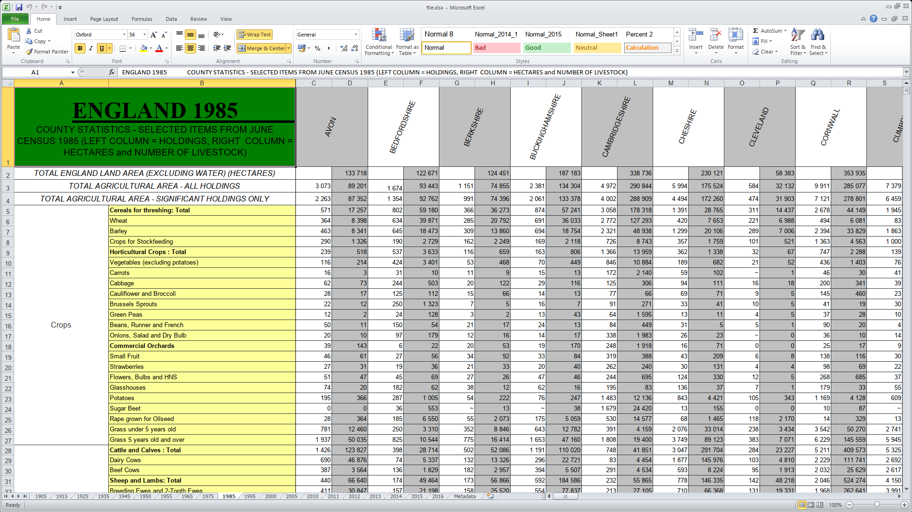

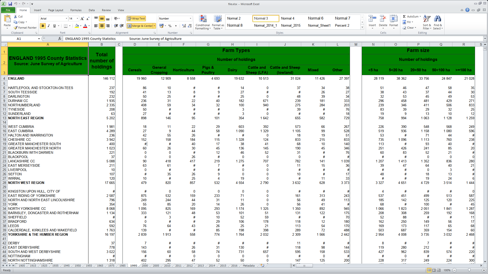

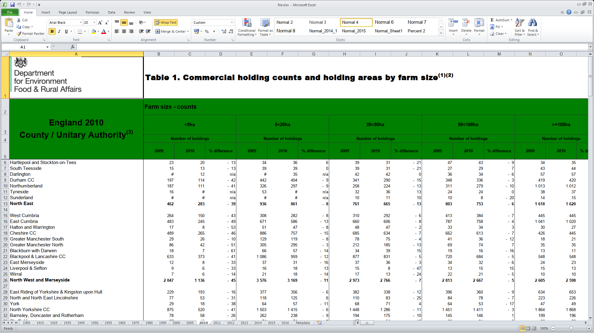

## structure-june-eng-farmtypeseries-13dec18

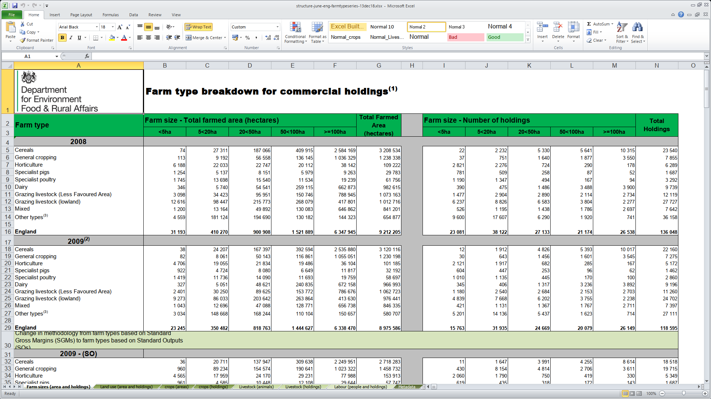

## structure-june-Englandsizebands-22nov18

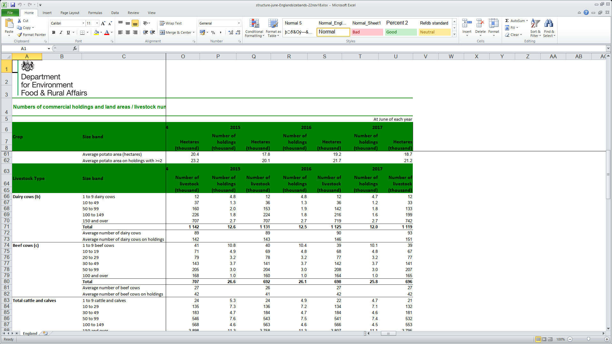

## structure-june-eng-lessfavouredareas-13dec17

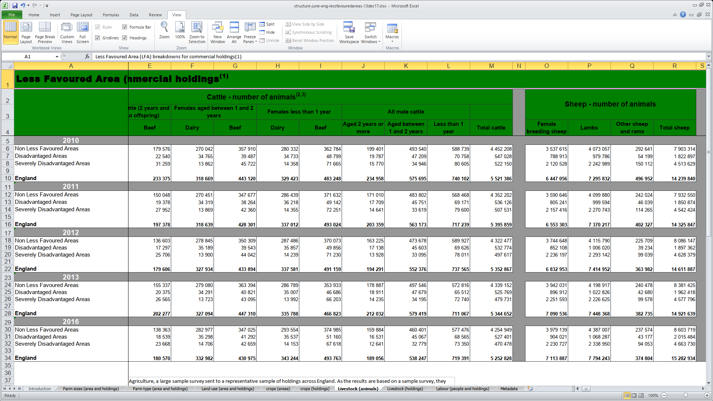

## structure-june-eng-localauthority-09jan18

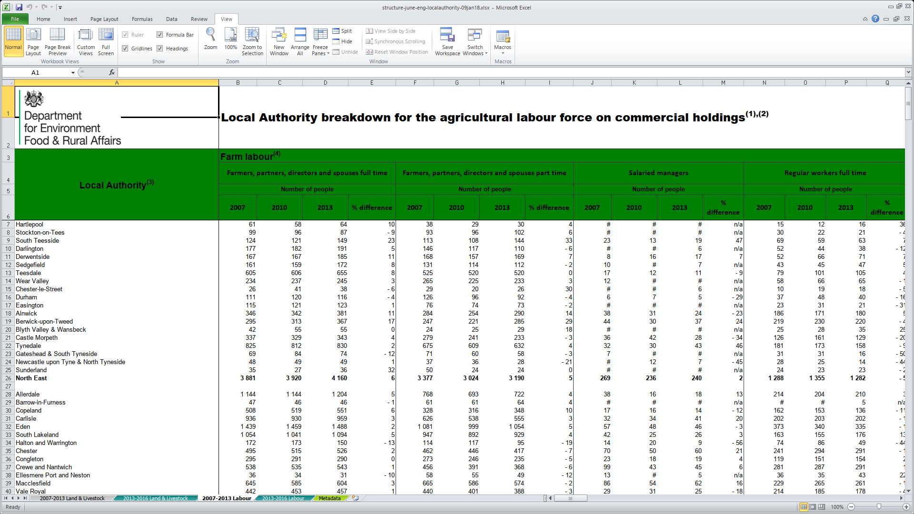

## structure-june-eng-series-25oct18

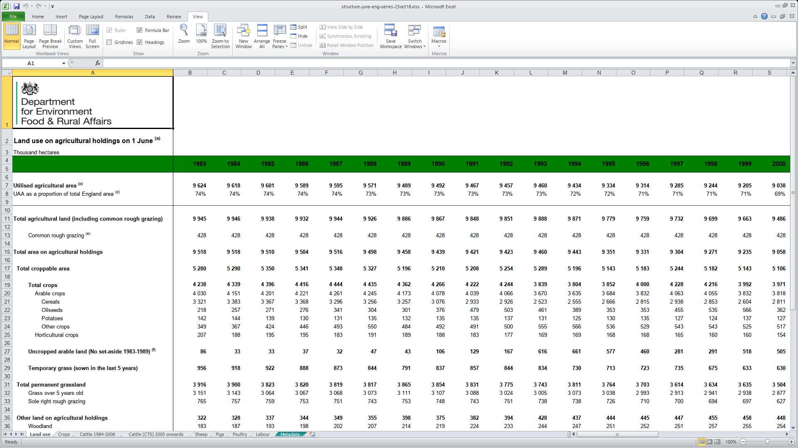

## structure-june-otherseries-naturepartnership-24aug18

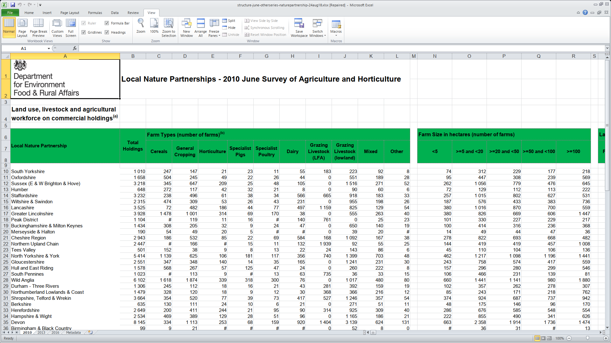

## structure-june-ukcerealoilseed-21dec2017

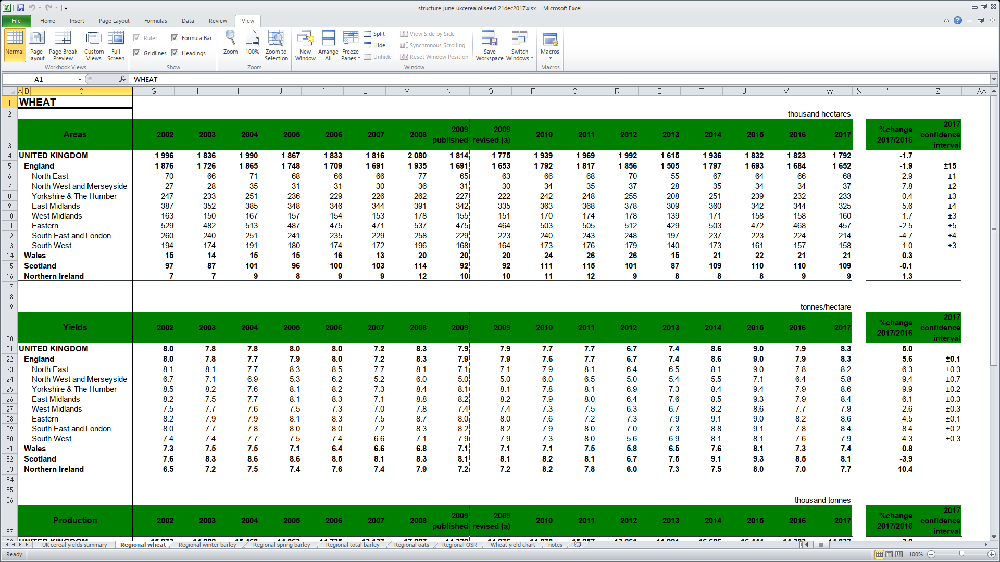

## structure-june-ukkeyresults-21dec17

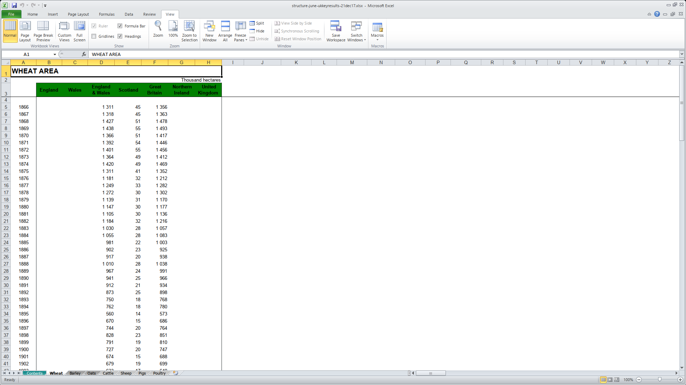

## structure-june-UKsizebands-22nov18

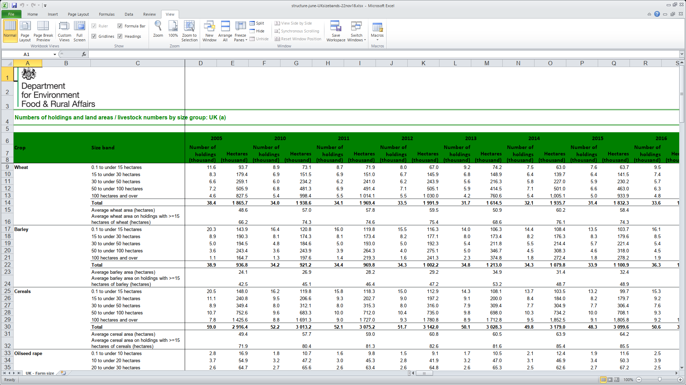

## structure-june-uktimeseries-11oct18

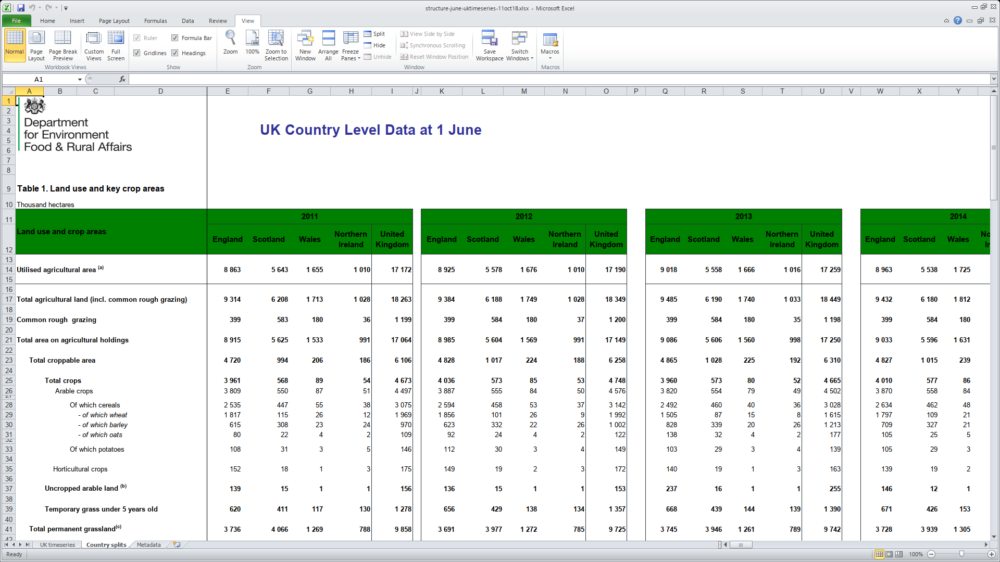
